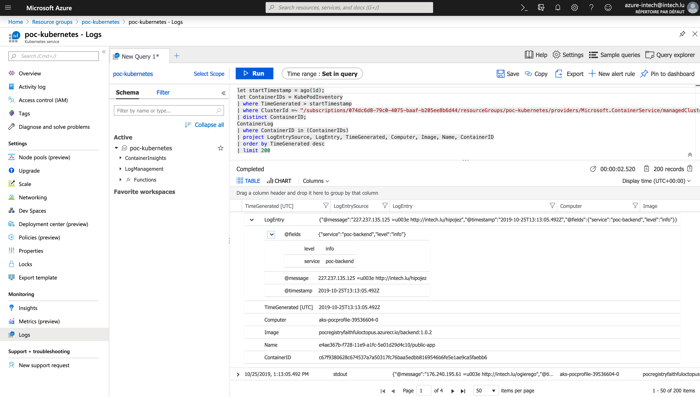

# Report

This file contains report of expected output in the PoC.

After deploying the platform itself with **terraform**

```text
Apply complete! Resources: 1 added, 0 changed, 1 destroyed.

Outputs:

container_registry_name = PoCRegistryfaithfuloctopus
container_registry_url = pocregistryfaithfuloctopus.azurecr.io
kubernetes_cluster_name = poc-kubernetes
ressource_group_name = poc-kubernetes
```

Note the **container_registry_url** used for `docker tag`, `docker push`, and helm values.

Then after connecting to Kube with `az aks get-credentials --resource-group poc-kubernetes --name poc-kubernetes`,
we can check with `cat ~/.kube/config` than the cluster is configured.

You should have a context, a cluster and a user.

```text
- context:
    cluster: poc-kubernetes
    user: clusterUser_poc-kubernetes_poc-kubernetes
  name: poc-kubernetes
current-context: poc-kubernetes
```

```text
- cluster:
    certificate-authority-data: ...
    server: https://poc-kubernetes-e2cee503.hcp.francecentral.azmk8s.io:443
  name: poc-kubernetes
```

```text
- name: clusterUser_poc-kubernetes_poc-kubernetes
  user:
    client-certificate-data: ...
    client-key-data: ...
    token: ...
```

Login to Azure Container Registry with `az acr login --name PoCRegistryfaithfuloctopus`

Check configuration with `cat ~/.docker/config.json`

```text
{
	"auths": {
		"pocregistryfaithfuloctopus.azurecr.io": {}
	},
	"HttpHeaders": {
		"User-Agent": "Docker-Client/19.03.4 (darwin)"
	},
	"credsStore": "osxkeychain",
	"stackOrchestrator": "swarm"
}
```

In the `platform` folder, deploy the helm account with ` kubectl apply -f helm-rbac.yaml`.

```text
serviceaccount/tiller created
clusterrolebinding.rbac.authorization.k8s.io/tiller created
```

Then init Tiller `helm init --history-max 200 --service-account tiller --node-selectors "beta.kubernetes.io/os=linux"`

```text
$HELM_HOME has been configured at /Users/pierrepaci/.helm.

Tiller (the Helm server-side component) has been installed into your Kubernetes Cluster.

Please note: by default, Tiller is deployed with an insecure 'allow unauthenticated users' policy.
To prevent this, run `helm init` with the --tiller-tls-verify flag.
For more information on securing your installation see: https://docs.helm.sh/using_helm/#securing-your-helm-installation
```

In the `applications/backend` folder, build and push app with

```shell
REGISTRY_URL=pocregistryfaithfuloctopus.azurecr.io
docker build -t $REGISTRY_URL/backend:1.0.2 .
docker push $REGISTRY_URL/backend:1.0.2
```

and then deploy app with app

```shell
helm install -f values.poc.yaml ../public-app --name=backend-api
```

```text
NAME:   backend-api
LAST DEPLOYED: Fri Oct 25 15:59:04 2019
NAMESPACE: default
STATUS: DEPLOYED

RESOURCES:
==> v1/Deployment
NAME         READY  UP-TO-DATE  AVAILABLE  AGE
backend-api  0/2    2           0          1s

==> v1/Pod(related)
NAME                          READY  STATUS             RESTARTS  AGE
backend-api-595cb7d8d7-2b6c5  0/1    ContainerCreating  0         1s
backend-api-595cb7d8d7-cmtk6  0/1    ContainerCreating  0         1s

==> v1/Service
NAME         TYPE          CLUSTER-IP    EXTERNAL-IP  PORT(S)       AGE
backend-api  LoadBalancer  10.0.223.248  <pending>    80:32161/TCP  1s


NOTES:
1. Get the application URL by running these commands:
     NOTE: It may take a few minutes for the LoadBalancer IP to be available.
           You can watch the status of by running 'kubectl get --namespace default svc -w backend-api'
  export SERVICE_IP=$(kubectl get svc --namespace default backend-api --template "{{ range (index .status.loadBalancer.ingress 0) }}{{.}}{{ end }}")
  echo http://$SERVICE_IP:80
```

After ~1 minutes, you should be able to `helm status backend-api` to get the service **EXTERNAL-IP**.

```text
==> v1/Service
NAME                  TYPE          CLUSTER-IP    EXTERNAL-IP     PORT(S)       AGE
backend-api           LoadBalancer  10.0.223.248  52.143.153.182  80:32161/TCP  3m34s
```

Head over to `52.143.153.182` (adapt it to your output) and you should see a JSON of logs.

In azure portal, on the kubernetes resource page, you see the log of the application.
Log are parsed by azure since appliation output in a standard format (logstash json).

